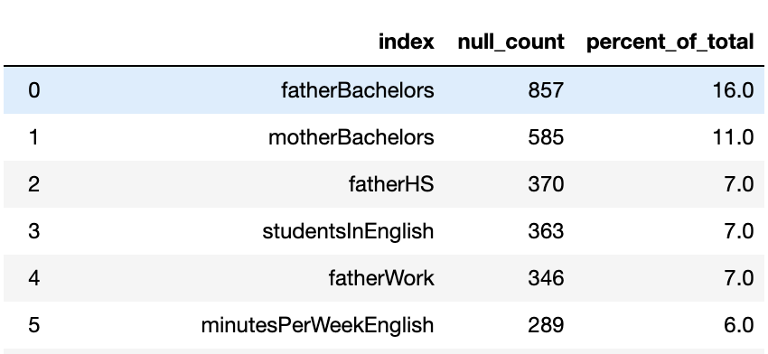
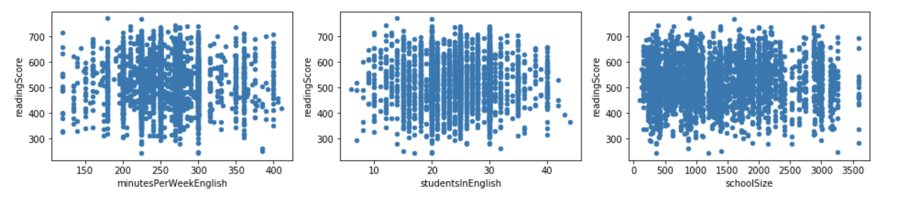
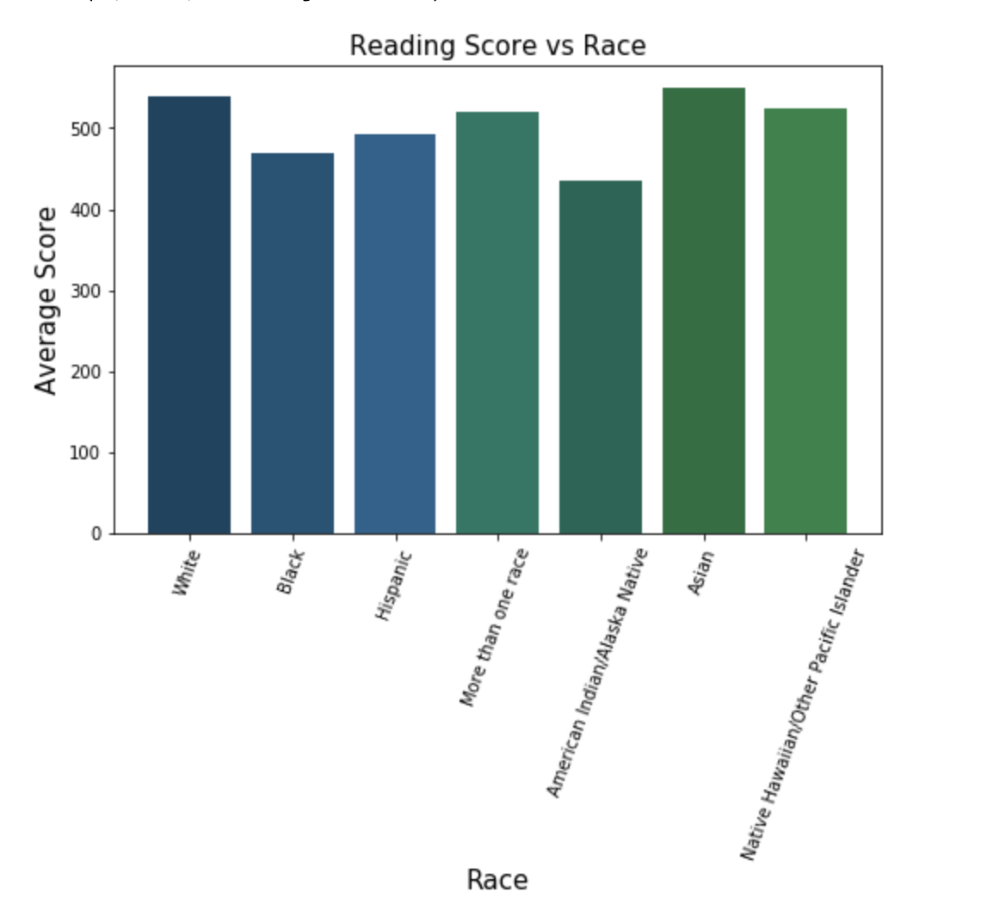

# mod2project

## About

#### Source:
We took our data from a MIT course assignment linked here.
https://ocw.mit.edu/courses/sloan-school-of-management/15-071-the-analytics-edge-spring-2017/linear-regression/assignment-2/reading-test-scores/

#### Our Data at a glance:
Our subset contains information about the demographics and schools for American students taking the exam, derived from 2009 PISA Public-Use Data Files http://nces.ed.gov/pubsearch/pubsinfo.asp?pubid=2011038                                                  
(PISA) The Programme for International Student Assessment is a test given every three years to 15-year-old students from around the world to evaluate their performance in mathematics, reading, and science. 

#### Features of our data:

* grade: The grade in school of the student (most 15-year-olds in America are in 10th grade)
* male: Whether the student is male (1/0)
* raceeth: The race/ethnicity composite of the student
* preschool: Whether the student attended preschool (1/0)
* expectBachelors: Whether the student expects to obtain a bachelor's degree (1/0)
* motherHS: Whether the student's mother completed high school (1/0)
* motherBachelors: Whether the student's mother obtained a bachelor's degree (1/0)
* motherWork: Whether the student's mother has part-time or full-time work (1/0)
* fatherHS: Whether the student's father completed high school (1/0)
* fatherBachelors: Whether the student's father obtained a bachelor's degree (1/0)
* fatherWork: Whether the student's father has part-time or full-time work (1/0)
* selfBornUS: Whether the student was born in the United States of America (1/0)
* motherBornUS: Whether the student's mother was born in the United States of America (1/0)
* fatherBornUS: Whether the student's father was born in the United States of America (1/0)
* englishAtHome: Whether the student speaks English at home (1/0)
* computerForSchoolwork: Whether the student has access to a computer for schoolwork (1/0)
* read30MinsADay: Whether the student reads for pleasure for 30 minutes/day (1/0)
* minutesPerWeekEnglish: The number of minutes per week the student spend in English class
* studentsInEnglish: The number of students in this student's English class at school
* schoolHasLibrary: Whether this student's school has a library (1/0)
* publicSchool: Whether this student attends a public school (1/0)
* urban: Whether this student's school is in an urban area (1/0)
* schoolSize: The number of students in this student's school
* readingScore: The student's reading score, on a 1000-point scale

#### Goal:
We will try to predict the reading scores of students from the US on the 2009 PISA exam. Using Linear Regression models such as OLS (ordinary least squares), Polynomials, Ridge, and Lasso.

## Preprocessing

#### Null values
In the image below you can see the columns with the count of null values and what percentage of that column is null.

As you can see the columns about if the parents have a bachelor degree has more than 10% null values. There is a risk that these parents were simply embarassed and therefore did not provide their information, therefore, if we simply drop these nulls we may be introducing some bias to our datasets. We concluded it was best to drop these two columns.
For the rest of the dataset, we simply dropped the rows with null values.

#### Outliers

Since our dataset included some extreme outliers we went with a conventional route of removing them.
We found our Upper fence and Lower fence and removed everything outside of them.
The formula is:
Upper fence = Q3 + (1.5 * IQR)
Lower fence = Q1 – (1.5 * IQR)
Where IQR is the interquartile range

## Exploratory Data Analysis

We plotted our continuous features against readingScore and can clearly see no linear relationship exists here

## Hypothesis Testing

#### Students with working parents vs non working parents
Does having both parents who don't work influence the childs reading score?
We've found a statistical significant difference between the mean reading scores for those with working parents vs without.  

Average score for students with at least one working parent: 524.81                                                        
Avergae score for students with parents who don't work: 495.77             

#### Students who speak english at home vs those who do not
This one seems quite logical, if the language spoken at home is not English will that affect the childs reading score?
We've found a statistical significant difference between the mean reading scores for those who speak English at home vs those who don't.

Average score for students who speak english at home: 527.25                                               
Avergae score for students who don't speak english at home: 494.63

#### Students with a parent that graduated high school vs those without one
If a student has a parent with a high school diploma will that student perform differently on the reading test?
As it turns out that student will indeed perform differently on average.

Average score for students with a parent who graduated High school: 526.37
Average score for students with parents who didn't graduate High school: 478.93

#### Students who attend public school vs those who don't
Public vs Private school will there students perform the same on the reading test?
Well we can assure you that according to our data they will not perform the same on average.

Average score for students from Public schools: 520.63                                              
Average score for students from Private schools: 551.61

#### Students with a parent from the US vs those without one
If a students parents are not from the US will that have an influence on that students reading score?

Average score for students with a parent born in the US: 526.95                                              
Average score for students with parents born outside of the US: 507.19

#### Average reading score for students of different races
We were unable to perform Anova testing since some of the races in our dataset are not presented with enough datapoints

## Regression Model

Continuous features are: minutesPerWeekEnglish, studentInEnglish, schoolSize
Categorical features are all the rest.

#### OLS
We started with building a ols model which considers all of our features, which resulted with
R squared: 	0.271
Training Data RMSE: 75.54                                                                             
Validation Data RMSE: 70.27                               
Some feature P values were high so we couldn't rely on them as predictors. To our surprise, the amount of minutes a student studied English in class did not contribute well to our model, with a P value of: 0.647
These are the features with a high P value which we removed from our model, "preschool, motherWork, selfBornUS, fatherBornUS, Morethanonerace, minutesPerWeekEnglishscaled"
The performance of this model stayed about equal, with
R squared: 0.271
Training Data RMSE: 75.55
Validation Data RMSE: 70.21

After inspecting the data once more, we concluded to make a ols model on just the caterogical features. This model didn't perform too well with 
R squared: 0.262
Training Data RMSE: 76.02
Validation Data RMSE: 70.62
The performance of an ols just on the continuous, was even worse, with
R squared: 0.002
Training Data RMSE: 88.40
Validation Data RMSE: 82.44

#### Polynomial
We tried out a polynomial model for our continuous variables and once again confirmed that these features are not good predictors, with
Training Data
RMSE: 87.79
R Squared: 0.015

Validation Data
RMSE: 82.81
R Squared: -0.007

#### Ridge

The performance of our Ridge cv
Training Data
RMSE: 75.78768689631224
R Squared: 0.26657035121327466

Testing Data
RMSE: 74.81643486418044
R Squared: 0.3170507122247701

#### Lasso

The performance of the Lasso
Training Data
RMSE: 75.81
R Squared: 0.26

Testing Data
RMSE: 74.96
R Squared: 0.31

## Conclusion & next steps

Being that most of the collected data is binary or categorical it seems that a linear model won't be sufficient to predict student test scores. 

