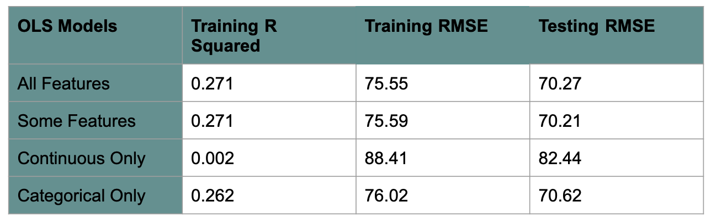
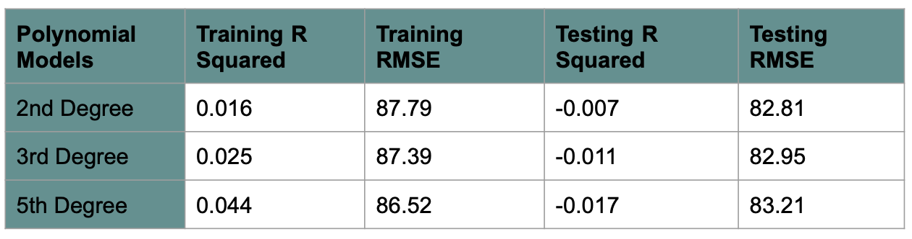
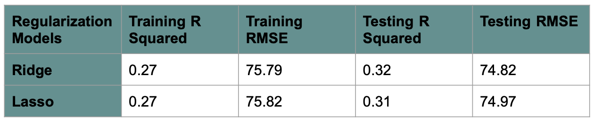

# Module 2 Final Project

Gabriela Lopez & Mendel Oster

## Introduction

For this project, we found a dataset and attempted to create a linear regression model for it.

### Source
We took our data from a MIT course assignment linked below
https://ocw.mit.edu/courses/sloan-school-of-management/15-071-the-analytics-edge-spring-2017/linear-regression/assignment-2/reading-test-scores/

### Our Data at a glance
Our subset contains information about the demographics and schools for American students taking the exam, derived from 2009 PISA Public-Use Data Files http://nces.ed.gov/pubsearch/pubsinfo.asp?pubid=2011038                                                  
(PISA) The Programme for International Student Assessment is a test given every three years to 15-year-old students from around the world to evaluate their performance in mathematics, reading, and science. 

#### Features of our data

* grade: The grade in school of the student (most 15-year-olds in America are in 10th grade)
* male: Whether the student is male (1/0)
* raceeth: The race/ethnicity composite of the student
* preschool: Whether the student attended preschool (1/0)
* expectBachelors: Whether the student expects to obtain a bachelor's degree (1/0)
* motherHS: Whether the student's mother completed high school (1/0)
* motherBachelors: Whether the student's mother obtained a bachelor's degree (1/0)
* motherWork: Whether the student's mother has part-time or full-time work (1/0)
* fatherHS: Whether the student's father completed high school (1/0)
* fatherBachelors: Whether the student's father obtained a bachelor's degree (1/0)
* fatherWork: Whether the student's father has part-time or full-time work (1/0)
* selfBornUS: Whether the student was born in the United States of America (1/0)
* motherBornUS: Whether the student's mother was born in the United States of America (1/0)
* fatherBornUS: Whether the student's father was born in the United States of America (1/0)
* englishAtHome: Whether the student speaks English at home (1/0)
* computerForSchoolwork: Whether the student has access to a computer for schoolwork (1/0)
* read30MinsADay: Whether the student reads for pleasure for 30 minutes/day (1/0)
* minutesPerWeekEnglish: The number of minutes per week the student spend in English class
* studentsInEnglish: The number of students in this student's English class at school
* schoolHasLibrary: Whether this student's school has a library (1/0)
* publicSchool: Whether this student attends a public school (1/0)
* urban: Whether this student's school is in an urban area (1/0)
* schoolSize: The number of students in this student's school
* readingScore: The student's reading score, on a 1000-point scale

### Goal
To predict the reading scores of students from the US on the 2009 PISA exam using Linear Regression models such as OLS (ordinary least squares), Polynomials, Ridge, and Lasso. Additionally, we'll run some statistical tests on the provided data.

### Libraries Used

    **Data Cleaning**
    Pandas
    Seaborn
    Matplotlib

    **Hypothesis Testing**
    Pandas
    Matplotlib
    Scipy
    Statsmodels

    **Regression Model**
    Pandas
    Sklearn
    Matplotlib
    Numpy
    Statsmodels
    Re
    Math

## Preprocessing

    See: Data Cleaning.ipynb

### Null values
In the image below you can see the columns with the count of null values and what percentage of that column is null.

As you can see the columns about if the parents have a bachelor degree has more than 10% null values. There is a risk that these parents were simply embarassed and therefore did not provide their information, therefore, if we simply drop these nulls we may be introducing some bias to our datasets. We concluded it was best to drop these two columns.
For the rest of the dataset, we simply dropped the rows with null values.

### Categorical Features

Besides all of our dummy variables, there were two categorical variables. Of these, `raceeth` was made up of string values. To be able to work with this data, we created dummy variables for this column.

### Outliers

Since our dataset included some extreme outliers we went with a conventional route of removing them.
We found our Upper fence and Lower fence and removed everything outside of them.
The formula is:
Upper fence = Q3 + (1.5 * IQR)
Lower fence = Q1 – (1.5 * IQR)
Where IQR is the interquartile range

## Exploratory Data Analysis

After cleaning, our data has 3,109 rows, 27 feature columns, and one target column. It's made up of float and integer values.

Of the feature columns, there are 3 quantitative columns, which we are treating as continuous values for our model. All others are categorical with values being either 0 or 1.

We will look at the distribution of these columns and their correlation more when starting to build our model.

## Hypothesis Testing

    See: Hypothesis Testing.ipynb

Next, we made observations and asked questions of our data. We checked various groups for a statistical difference in their reading scores.

*Alternative Hypothesis: There is a statistically significant difference in the reading scores of these groups.*

*Null Hypothesis: There is no statistically significant difference between the reading scores of these groups.*

For all of the following groups we were able to reject the null hypothesis. This means we found the difference between the means of these groups is indeed statistically significant.

### Students with working parents vs non working parents
Average score for students with at least one working parent: 524.81
Average score for students with parents who don't work: 495.77

### Students who speak english at home vs those who do not
Average score for students who speak english at home: 527.25
Average score for students who don't speak english at home: 494.63

### Students with a parent that graduated high school vs those without one
Average score for students with a parent who graduated High school: 526.37
Average score for students with parents who didn't graduate High school: 478.93

### Students who attend public school vs those who don't
Average score for students from Public schools: 520.63
Average score for students from Private schools: 551.61

### Students with a parent from the US vs those without one
Average score for students with a parent born in the US: 526.95
Average score for students with parents born outside of the US: 507.19

### Average reading score for students of different races
We were unable to perform Anova testing for this since some of the races in our dataset are not presented with enough datapoints. However, to visualize the difference between these in our data, we've included the plot below.

### 95% Confidence Interval for Mean of Population Reading Score

We calculated a 95% confidence interval of 350.98 - 696.12.

## Regression Model

    See: Regression Model.ipynb

Our first step in model building was looking for multicollinearity. We found `motherBornUS` and `fatherBornUS` to be highly correlated. To pick which one to remove, we looked for which has a smaller correlation with our target variable. 

Next, we needed to choose which one of our dummy variable columns to drop to avoid redundancy. To pick which one to drop we followed the same step of looking for lowest correlation with target variable.

As mentioned in our EDA, we had 3 continuous features to work with. We plotted these against our target, and saw that no linear relationship exists.

We also saw they had non-normal distributions with very differnt ranges.

Our next step was to split the data into a training, testing, and validation set. We then created a scaler from the training set and used it to scale all three sets. This standardized our continuous variables and helped make our results more trustworthy.

### OLS
For our first model, we used all of the features in our dataset.

The results of our first model showed many features with high p-values. For our second model, we removed any variable which had a p-value higher than 0.5 in our first model. These removed variables were: `preschool`, `motherWork`, `selfBornUS`, `fatherBornUS`, `Morethannorace`, and `minutesPerWeekEnglishscaled`.

Next, we thought it might be useful to split up the categorical and the continuous variables into two models. 

Below is a summary of the results we got from these models.

###  Polynomial
We decided to try out a polynomial model for our continuous variables and once again confirmed that these features are not good predictors.

As you can see, we could get better (albeit not good) results by choosing a higher order polynomial model. However our testing results only got worse, meaning we are overfitting our data.

### Ridge and Lasso

We got very similar values for our regularization models.

Additionally, we used the Lasso model to identify which features were unimportant by seeing which had a coefficient of zero. These were: `preschool`, `motherWork`, `selfBornUS`, `fatherBornUS`, `Morethannorace`, and `minutesPerWeekEnglishscaled`. We are happy to see these were the values we deemed less important in our second OLS model.

## Conclusion & Next Steps

In the end, we weren't able to find a good linear regression model for this dataset. This is probably because most of the collected data is categorical, and our continuous variables did not have a linear relationship with the target variables. As such, it seems that a linear model won't be sufficient to predict student test scores with this data. 

Our model with the smallest Root Mean Squared Error (RMSE) is our second OLS Model. From this model's results, we can see that the variables with the biggest impact (lowest p-value, highest coefficient) are:
* `expectBachelors`
* `read30MinsADay`
* `Black`

Possible ways to continue this project:
* Complete hypothesis tests on the rest of the groups
* Complete an ANOVA test for the different grades
* Improve OLS model by developing new continuous features
 

